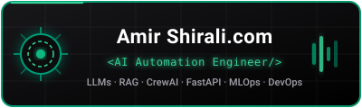

  <h1>Amir Shirali Pour</h1>
  
<strong>Ingénieur Logiciel — Python · DevOps · IA appliquée</strong> 
  <em>Software Engineer — Python · DevOps · Applied AI (LLM &amp; multi-agent systems)</em>

  
  &nbsp;&nbsp;
  

---

Master Informatique (Université de Montpellier) with 4 years of production experience in
Python automation and network/telecom infrastructure. I build systems that run: automation
pipelines, FastAPI backends, containerised deployments — increasingly driven by LLMs and
multi-agent orchestration, with measurable results (up to ~80% faster, ~85% lower API cost
on a production pipeline).

**Based in Montpellier (France) · open to CDI/CDD across France — on-site, hybrid or remote.**
Authorised to work in France, no sponsorship required.

## 🏗 Architecture Focus: Automated Financial Video Pipeline

I am actively building a fully automated end-to-end pipeline that transforms raw financial data into published video content using Machine Learning / Deep Learning / Reinforcement Learning and Multi-Agent Systems.

  

## 🛠 Stack

| Domain | Technologies |
|--------|--------------|
| **Backend & APIs** | Python 3.12+, FastAPI, Flask, Streamlit, PostgreSQL, Celery |
| **DevOps & Infra** | Docker, GitHub Actions (CI/CD), Linux, Nginx, VPS, Git |
| **LLM & Agents** | LangChain, LiteLLM, CrewAI, OpenAI API, Gemini, Multi-Agent Systems |
| **RAG & Retrieval** | ChromaDB, FlashRank, Ragas, NetworkX, Vector Stores |
| **Network & Monitoring** | Cisco IOS, SNMP, Syslog, SolarWinds, Power BI |

## 🚀 Featured Projects

| Project | Description | Stack |
|:-------:|:------------|:------|
| **[Cisco Manager](https://github.com/su6i/cisco-manager)** | Full-stack network management dashboard with real-time SNMP/Syslog telemetry for Cisco devices, PostGIS-backed topology, and intelligent Telegram alerting. | `Python` `FastAPI` `Next.js` `PostGIS` `SNMP` `Syslog` |
| **[Su6i Yar](https://github.com/su6i/su6i-yar)** | AI-powered Telegram bot with an 8-layer Gemini/DeepSeek fallback chain, fact-checking, Instagram downloads, and multilingual Voice TTS (FA/EN/FR/KO). | `Python` `LangChain` `Gemini` `edge-tts` |
| **[LinguaFlash](https://github.com/su6i/LinguaFlash)** | Smart Chrome Extension for language learning with TTS pronunciation. **[Live on Chrome Web Store](https://chromewebstore.google.com/detail/kbnggdhjaflioffhgjngoopojcmoaano)**. | `JavaScript` `Chrome API` `TTS` |
| **[ApplyForge](https://github.com/su6i/ApplyForge)** | End-to-end job application automation: a multi-agent pipeline that scrapes job postings, filters them against hard rules, selects the right CV variant, generates personalised cover letters via LLM, and delivers ready-to-send PDFs via Telegram. | `Python` `LangChain` `CrewAI` `Gemini` `Selenium` |
| **[ai-router](https://github.com/su6i/ai-router)** | Cost-aware LLM router for multi-agent workflows: routes each task to the cheapest capable model, exposes an MCP server, and audits budget per call. | `Python` `MCP` `LiteLLM` |
| **[Amir CLI](https://github.com/su6i/amir-cli)** | All-in-one terminal assistant with AI integration (Gemini/DeepSeek), smart video compression, and system automation tools. | `Bash` `Python` `FFmpeg` |

## 🌐 Languages
- **French**: C1 — professional working proficiency
- **English**: Professional working proficiency
- **Persian**: Native

## 📫 Contact
- 📍 Montpellier, France — open to relocation within France
- 📧 [sushiant60@gmail.com](mailto:sushiant60@gmail.com)
- 💼 [linkedin.com/in/su6i](https://www.linkedin.com/in/su6i/)
- 🐙 [github.com/su6i](https://github.com/su6i)

## ⚡ Recent Activity
<!--START_SECTION:activity-->
<!--END_SECTION:activity-->

## 📊 GitHub Stats

  
  

  

